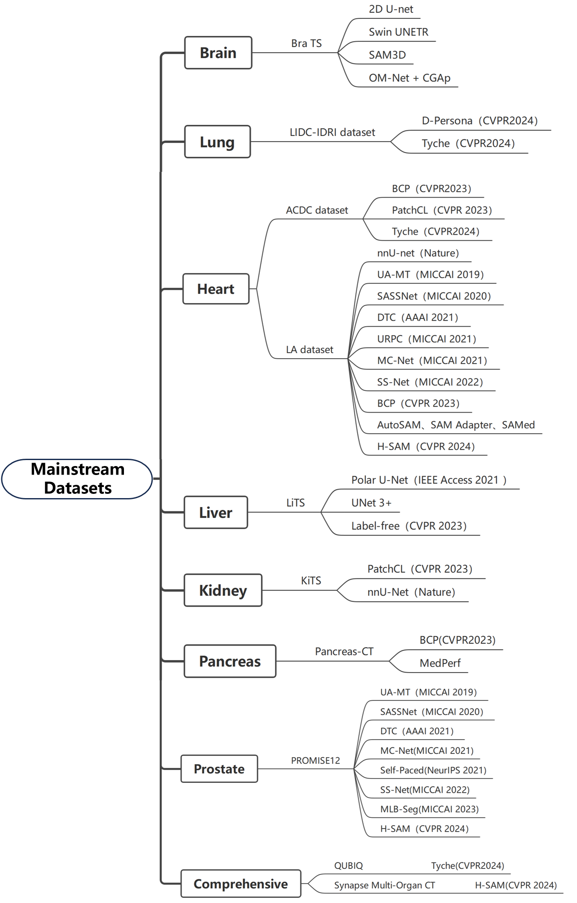
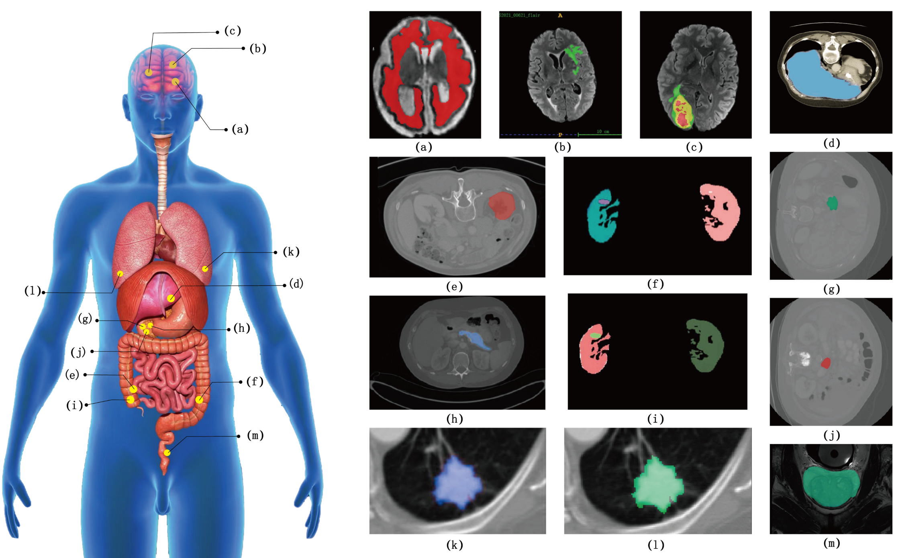

# MedSeg_CBB
A Comprehensive Survey of Medical Image Segmentation: Challenges, Benchmarks, and Beyond

## Contents

- [Mainstream Datasets](#mainstream_datasets)
- [Main Comparison Methods](#main_comparison_methods)

 
## Mainstream Datasets

 
 
|      Organ     |      Dataset Name     | Paper Title                                                                                                                                                                     | Download          |
|:--------------:|:---------------------:|---------------------------------------------------------------------------------------------------------------------------------------------------------------------------------|-------------------|
|      Brain     |          BraTS        | [The RSNA-ASNR-MICCAI BraTS 2021 Benchmark on Brain Tumor Segmentation and Radiogenomic Classification](https://https://arxiv.org/abs/2107.02314)                               | [Link](https://www.cancerimagingarchive.net/analysis-result/rsna-asnr-miccai-brats-2021/)        |
|      Lung      |        LIDC-IDRI      | [The Lung Image Database Consortium (LIDC) and Image Database Resource Initiative (IDRI): A Completed Reference Database of Lung Nodules on CT Scans](https://pmc.ncbi.nlm.nih.gov/articles/PMC3041807/)                                                                                                                                                                        | [Link](https://www.kaggle.com/datasets/zhangweiled/lidcidri) |
|      Heart     |           ACDC        | [Deep Learning Techniques for Automatic MRI Cardiac Multi-Structures Segmentation and Diagnosis: Is the Problem Solved?](https://ieeexplore.ieee.org/abstract/document/8360453) | [Link](https://www.kaggle.com/datasets/anhoangvo/acdc-dataset) |
|      Heart     |            LA         | [A global benchmark of algorithms for segmenting the left atrium from late gadolinium-enhanced cardiac magnetic resonance imaging](https://www.sciencedirect.com/science/article/abs/pii/S1361841520301961)                                                                                                                                                  | [Link](https://www.cardiacatlas.org/atriaseg2018-challenge/atria-seg-data/) |
|      Liver     |           LiTS        | [The Liver Tumor Segmentation Benchmark (LiTS)](https://www.sciencedirect.com/science/article/pii/S1361841522003085)                                                            | [Link](https://www.kaggle.com/datasets/harshwardhanbhangale/lits-dataset)  |
|      Kidney    |           KiTS        | [The KiTS21 Challenge: Automatic segmentation of kidneys, renal tumors, and renal cysts in corticomedullary-phase CT](https://arxiv.org/abs/2307.01984)                         | [Link](https://github.com/neheller/kits23)  |
|     Pancreas   |       Pancreas-CT     | [Data from pancreas-CT](https://cir.nii.ac.jp/crid/1881991018017321216)                                                                                                         | [Link](https://www.cancerimagingarchive.net/collection/pancreas-ct/)  |
|      Prostate  |        PROMISE12      | [Evaluation of prostate segmentation algorithms for MRI: The PROMISE12 challenge](https://www.sciencedirect.com/science/article/abs/pii/S1361841513001734?via%3Dihub)           | [Link](https://paperswithcode.com/dataset/promise12)  |
| Comprehensive  |           QUBIQ       | [QUBIQ: Uncertainty Quantification for Biomedical Image Segmentation Challenge](https://arxiv.org/html/2405.18435v2)                                                            | [Link](https://qubiq.grand-challenge.org/participation/)     |
| Comprehensive  |Synapse Multi-Organ CT | [MICCAI 2015 Multi-Atlas Abdomen Labeling Challenge](https://www.synapse.org/Synapse:syn3193805/wiki/217789)                                                                    | [Link](https://paperswithcode.com/sota/medical-image-segmentation-on-synapse-multi)     |

 

## Main Comparison Methods

 
### U-Net Based Methods

| Year |  Venue  |   Acronym   | Paper Title                                                                                                                                                            | Code/Project                   |
|:----:|:-------:|:-----------:|------------------------------------------------------------------------------------------------------------------------------------------------------------------------|--------------------------------|
| 2015 |  MICCAI |    U-Net    | [U-Net: Convolutional Networks for Biomedical Image Segmentation](https://link.springer.com/chapter/10.1007/978-3-319-24574-4_28)                                      | [Code](https://lmb.informatik.uni-freiburg.de/people/ronneber/u-net/)|
| 2016 |  MICCAI |    V-Net    | [V-Net: Fully Convolutional Neural Networks for Volumetric Medical Image Segmentation](https://ieeexplore.ieee.org/abstract/document/7785132)                          | [Code](https://github.com/faustomilletari/VNet) |
| 2018 | NeurIPS |  Prob.U-Net | [A Probabilistic U-Net for Segmentation of Ambiguous Images](https://proceedings.neurips.cc/paper_files/paper/2018/hash/473447ac58e1cd7e96172575f48dca3b-Abstract.html)| [Code](https://github.com/SimonKohl/probabilistic_unet) |
| 2019 |  MICCAI |    UA-MT    | [Uncertainty-aware Self-ensembling Model for Semi-supervised 3D Left Atrium Segmentation](https://link.springer.com/chapter/10.1007/978-3-030-32245-8_67)              | [Code](https://github.com/yulequan/UA-MT)  |
| 2020 | NeurIPS |   CM-Pixel  | [Disentangling HumanErrorfrom the Ground Truth in Segmentation of Medical Images](https://arxiv.org/abs/2007.15963)                                                    | [Code](https://github.com/moucheng2017/Learn_Noisy_Labels_Medical_Images.) |
| 2020 |  Nature |   nnU-Net   | [nnU-Net: a self-configuring method for deep learning-based biomedical image segmentation](https://www.nature.com/articles/s41592-020-01008-z)                         | [Code](https://github.com/MIC-DKFZ/nnUNet) |
| 2020 |  MICCAI |   SASSNet   | [Shape-aware Semi-supervised 3D Semantic Segmentation for Medical Images](https://arxiv.org/abs/2007.10732)                                                            | [Code](https://github.com/kleinzcy/SASSnet) |
| 2021 |  AAAI   |    DTC    | [Semi-supervised Medical Image Segmentation through Dual-task Consistency](https://arxiv.org/abs/2009.04448)                                                             | [Code](https://github.com/HiLab-git/DTC)     |
| 2021 |  MICCAI |   MC-Net  | [Semi-supervised Left Atrium Segmentation with Mutual Consistency Training](https://arxiv.org/abs/2103.02911)                                                            | [Code](https://github.com/ycwu1997/MC-Net)          |
| 2021 |  MICCAI |    URPC    | [Efficient Semi-Supervised Gross Target Volume of Nasopharyngeal Carcinoma Segmentation via Uncertainty Rectified Pyramid Consistency](https://arxiv.org/abs/2212.13764)| [Code](https://github.com/HiLab-git/SSL4MIS)     |
| 2021 |  MICCAI |   SS-Net   | [Exploring Smoothness and Class-Separation for Semi-supervised Medical Image Segmentation](https://arxiv.org/abs/2203.01324)                                            | [Code](https://github.com/ycwu1997/SS-Net) |
| 2022 |  CVPR   |    RD4AD    | [Anomaly Detection via Reverse Distillation from One-Class Embedding](https://arxiv.org/abs/2201.10703)                                                                | [Code](https://github.com/hq-deng/RD4AD)     |
| 2022 |   TMI   |   CoraNet  | [Inconsistency-aware Uncertainty Estimation for Semi-supervised Medical Image Segmentation](https://arxiv.org/abs/2110.08762)                                           | [Code](https://github.com/koncle/CoraNet)          |
| 2023 |  CVPR   |    BCP    | [Bidirectional Copy-Paste for Semi-Supervised Medical Image Segmentation](https://arxiv.org/abs/2305.00673)                                                              | [Code](https://github.com/DeepMed-Lab-ECNU/BCP)     |
| 2023 |  ICCV   |   Pionono  | [Probabilistic Modeling of Inter- and Intra-observer Variability in Medical Image Segmentation](https://arxiv.org/abs/2307.11397)                                       | [Code](https://github.com/arneschmidt/pionono_segmentation.)          |

### Transformer Based Methods

| Year |  Venue  |   Acronym   | Paper Title                                                                                                                                  | Code/Project                                  |
|:----:|:-------:|:-----------:|----------------------------------------------------------------------------------------------------------------------------------------------|-----------------------------------------------|
| 2022 |  EMNLP  |    MedCLIP  | [MedCLIP: Contrastive Learning from Unpaired Medical Images and Text](https://arxiv.org/abs/2210.10163)                                      | [Code](https://github.com/RyanWangZf/MedCLIP)|
| 2023 |  MICCAI |     TAB     | [Transformer-based Annotation Bias-aware Medical Image Segmentation](https://arxiv.org/abs/2306.01340)                                       | N/A |
| 2023 |   CVPR  |    WinCLIP  | [WinCLIP: Zero-/Few-Shot Anomaly Classification and Segmentation](https://arxiv.org/abs/2303.14814)                                          | [Code](https://github.com/caoyunkang/WinClip) |
| 2023 |  arXiv  |    APRIL-GAN    | [APRIL-GAN: A Zero-/Few-Shot Anomaly Classification and Segmentation Method for CVPR 2023 VAND Workshop Challenge Tracks 1&2: 1st Place on Zero-shot AD and 4th Place on Few-shot AD](https://arxiv.org/abs/2305.17382)              | [Code](https://github.com/ByChelsea/VAND-APRIL-GAN)  |

### SAM Based Methods

| Year |  Venue  |   Acronym   | Paper Title                                                                                                                                  | Code/Project                                  |
|:----:|:-------:|:-----------:|----------------------------------------------------------------------------------------------------------------------------------------------|-----------------------------------------------|
| 2024 |  Nature |    MedSAM   | [Segment anything in medical images](https://www.nature.com/articles/s41467-024-44824-z)                                                     | [Code](https://github.com/bowang-lab/MedSAM)|
| 2024 | NeurIPS |    SegVol   | [SegVol: Universal and Interactive Volumetric Medical Image Segmentation](https://arxiv.org/abs/2311.13385)                                  | [Code](https://github.com/BAAI-DCAI/SegVol)|
| 2024 |  MICCAI |    SAM-U    | [SAM-U: Multi-box prompts triggered uncertainty estimation for reliable SAM in medical image](https://arxiv.org/abs/2307.04973)              | [Code](https://github.com/rabbitdeng/SAM-U) |
| 2024 |  arXiv  |     MSA     | [Medical SAM Adapter: Adapting Segment Anything Model for Medical Image Segmentation](https://arxiv.org/html/2304.12620v7)                   | [Code](https://github.com/SuperMedIntel/Medical-SAM-Adapter)|
| 2024 |  arXiv  |    SAMed    | [Customized Segment Anything Model for Medical Image Segmentation](https://arxiv.org/abs/2304.13785)                                         | [Code](https://github.com/hitachinsk/SAMed) |
| 2024 |  arXiv  |   AutoSAM   | [How to Efficiently Adapt Large Segmentation Model(SAM) to Medical Images](https://arxiv.org/abs/2306.13731)                                 | [Code](https://github.com/xhu248/AutoSAM) |
| 2024 |  arXiv  | SAM Adapter | [SAM Fails to Segment Anything? -- SAM-Adapter: Adapting SAM in Underperformed Scenes: Camouflage, Shadow, Medical Image Segmentation, and More](https://arxiv.org/abs/2304.09148)                                                                   | [Code](https://github.com/tianrun-chen/SAM-Adapter-PyTorch)|

### Other Methods

| Year |  Venue  |   Acronym   | Paper Title                                                                                                                                  | Code/Project                                  |
|:----:|:-------:|:-----------:|----------------------------------------------------------------------------------------------------------------------------------------------|-----------------------------------------------|
| 2019 |   CVPR  |  CM-Global  | [Learning From Noisy Labels By Regularized Estimation Of Annotator Confusion](https://arxiv.org/abs/1902.03680)                              | N/A |
| 2021 |   CVPR  |     MKD     | [Multiresolution Knowledge Distillation for Anomaly Detection](https://arxiv.org/abs/2011.11108)                                             | [Code](https://github.com/Niousha12/Knowledge_Distillation_AD)|
| 2022 |   CVPR  |  PatchCore  | [Towards Total Recall in Industrial Anomaly Detection](https://arxiv.org/abs/2106.08265)                                                     | [Code](https://github.com/amazon-research/patchcore-inspection.) |
| 2022 |   CVPR  |     DRA     | [Catching Both Gray and Black Swans: Open-set Supervised Anomaly Detection](https://arxiv.org/abs/2203.14506)                                | [Code](https://github.com/choubo/DRA)|
| 2022 |   WACV  |  CFlow-AD   | [CFLOW-AD: Real-Time Unsupervised Anomaly Detection with Localization via Conditional Normalizing Flows](https://arxiv.org/abs/2107.12571)   | [Code](https://github.com/gudovskiy/cflow-ad) |
| 2024 |   CVPR  |     BGAD    | [Explicit Boundary Guided Semi-Push-Pull Contrastive Learning for Supervised Anomaly Detection](https://arxiv.org/abs/2207.01463)            | [Code](https://github.com/xcyao00/BGAD) |

 
 
## Contributing

*The repository is built and maintained by Pengyu Zhu.*

If you have any questions or need help, you can send an email(pyzhu@ncepu.edu.cn) at any time to communicate.

